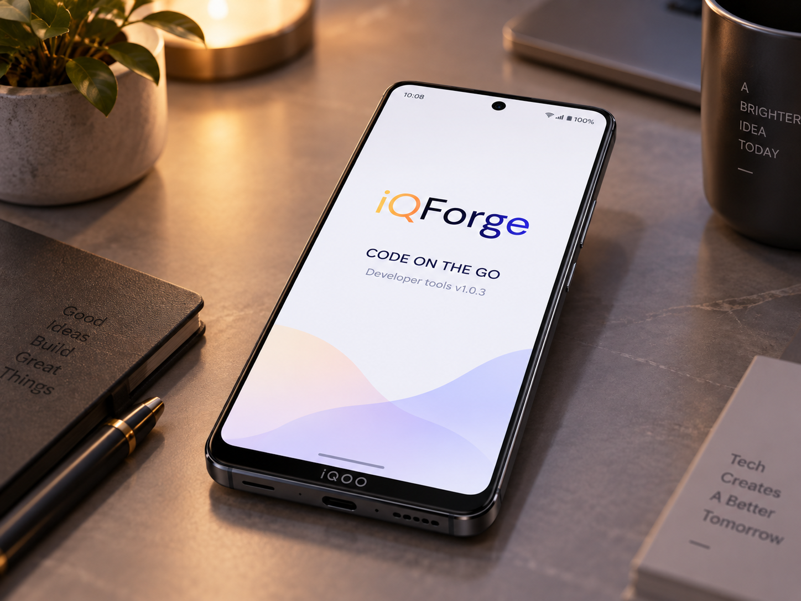

<div align="center">



<br />
<br />

# iQForge

### Clone. Code. Review. Ship. From your phone.

<p>
  <em>The model is offline. The phone is not.</em>
</p>

<p>
  
  
  
  
  
</p>

<p><strong>Team Limitless</strong> · iQOO Hackathon 2026 · Chennai City Battle · Developer Tools</p>

</div>

---

## Overview

A developer away from their desk can *read* code but not *work* on it. GitHub's mobile app
shows you a pull request but won't let you fix it. Every AI coding assistant is a cloud
service — it needs signal, costs per token, and still can't run your code.

**iQForge turns the iQOO 15 into a real development environment.** Clone a repository, edit
files in a real editor, and let a code model running on the Hexagon NPU write, explain,
review and debug alongside you. Then commit with an AI-written message and push straight
back to GitHub — all from the phone.

Inference never leaves the device: no API key, no per-token cost, no round-trip, and it
keeps working when your signal doesn't. Code moves over normal HTTPS to GitHub, where it
already lives, and never to a third-party AI vendor.

---

## What runs where

| Stage | On the phone · Hexagon NPU | On the laptop · Office Kit |
|:--|:--|:--|
| **Get** | Clone, pull, open a PR, scaffold a project | — |
| **Write** | Generate and complete functions in a real editor | Large multi-file refactors |
| **Review** | Diff review with risk and security flags | Whole-repo context passes |
| **Debug** | Stack trace → root cause → fix applied to the file | Errors needing a live run |
| **Test** | Lint, static checks, JS/Python snippets | `npm test`, full suites |
| **Ship** | AI commit message → commit → push → PR | `npm install`, builds, dev servers |

> **The rule:** the NPU handles anything that is *reasoning over code*.
> The laptop handles anything that needs *an operating system*.

---

## Built on iQOO hardware

| | |
|:--|:--|
| **Hexagon NPU** | Local code model — free, instant, works on bad signal |
| **LPDDR5X / UFS 4.0** | Model, KV cache, editor and file tree resident together |
| **50MP camera** | OCR a diff straight off a monitor or whiteboard |
| **Haptic engine** | A failed build or BUG finding is felt, not missed |
| **Gyroscope / proximity** | Tilt-scroll long diffs; face-down locks the session |
| **Office Kit** | The build-server bridge to the laptop tier |

---

## Repo layout

```
codebase/
├── android-app/      the phone app — Kotlin, Jetpack Compose, llama.cpp JNI
├── laptop-bridge/    FastAPI server — model escalation + toolchain execution
├── sample-diffs/     curated diffs for demoing
├── docs/             NPU benchmarks, GitHub integration design
└── CONTRACT.md       the interface everyone builds against — READ THIS FIRST
```

## Quickstart

```bash
# 1. Read the contract first — it's short, and it's why three people can build in parallel
cat CONTRACT.md

# 2. Open the app in Android Studio (runs with StubReviewEngine, no model needed)
#    android-app/

# 3. Run the laptop bridge
cd laptop-bridge && pip install -r requirements.txt && uvicorn server:app --host 0.0.0.0 --port 8000
```

> **Note:** the native build expects llama.cpp vendored at
> `android-app/app/src/main/cpp/llama.cpp/` — it's gitignored (too large to commit), so
> clone it there before building with the CMake path enabled.

---

## Status

| Component | State |
|:--|:--|
| Laptop-bridge escalation (FastAPI + Ollama) | ✅ Built and tested against sample diffs |
| GitHub PR fetch + share-intent | ✅ Built |
| Camera OCR, sensors, haptics | ✅ Built |
| On-device NPU inference (llama.cpp JNI) | 🚧 Integration written, build verification pending |
| Toolchain execution over Office Kit | 🚧 Next up |

Full task breakdown in [`TASKS.md`](TASKS.md) and the GitHub Issues on this repo.

---

<div align="center">

**Mukeshkumar M** · app shell, voice trigger, escalation logic
**Delfi A** · on-device inference
**Nambert Jones L** · laptop bridge, GitHub integration, camera & sensors

<br />

<sub>Built for the iQOO Hackathon 2026 · Developer Tools track</sub>

</div>
