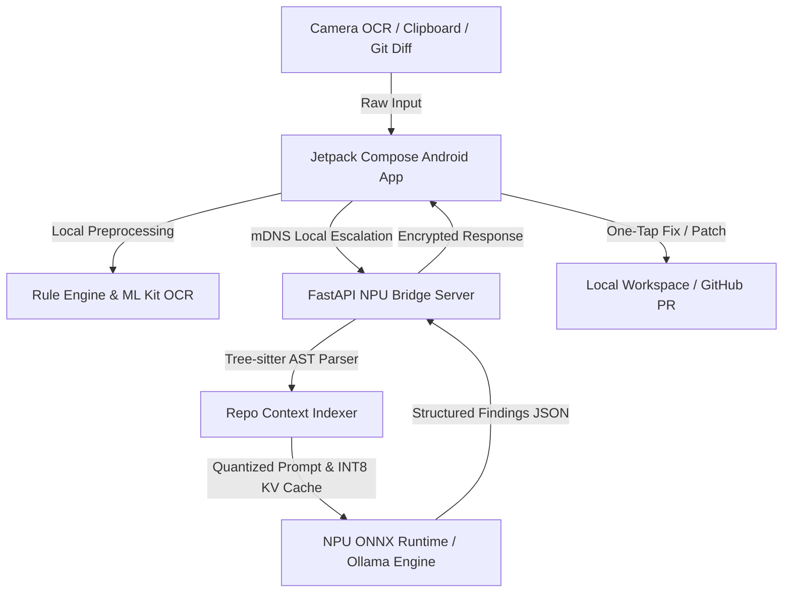

# 🚀 DevPulse: Next-Gen On-Device NPU Code Intelligence & Air-Gapped IDE Agent
**Team Limitless — iQOO Hackathon 2026**

---

## 📌 1. Executive Summary

| Category | Details |
|---|---|
| **Project Name** | **DevPulse (On-Device NPU Code Intelligence)** |
| **Team Name** | Team Limitless |
| **Core Thesis** | Complete privacy-first, zero-cloud code intelligence running on-device via NPU acceleration (iQOO Hexagon NPU & Laptop XDNA NPU) — bridging mobile multi-modal inputs with local IDE agent capabilities. |
| **Target Audience** | Enterprise software engineers, cybersecurity teams, fintech/defense devs with strict air-gapped NDA policies, and developers reviewing PRs on-the-go. |
| **Current Status** | ✅ Full-stack working prototype (Android Kotlin/Jetpack Compose app + Python/FastAPI Local NPU Bridge + Real Benchmark Validation). |

---

## 🛑 2. The Problem Statement

1. **IP Leakage & Compliance Barriers**:
   * Cloud AI assistants (GitHub Copilot, Cursor, ChatGPT) stream proprietary source code and enterprise IP to remote cloud servers.
   * Highly regulated industries (Fintech, Healthcare, Defense, Semiconductor) strictly forbid cloud-based code review tools.
2. **Disconnected / Travel Code Reviews**:
   * Developers reviewing PRs or debugging production hotfixes on mobile devices have zero intelligent tooling without internet.
3. **High Latency & Cloud Inference Costs**:
   * Enterprise cloud LLM hosting incurs massive GPU infrastructure bills ($10k-$100k+/month) and high network round-trip latencies.
4. **Friction in Physical Collaboration**:
   * Reviewing code on a colleague's monitor or in war rooms requires manual copy-pasting or file sharing.

---

## 💡 3. The Limitless Solution: DevPulse

**DevPulse** is a **two-tier, 100% air-gapped code intelligence system** designed specifically for NPU silicon:

```
+-----------------------------------------------------------------------------------+
|                            TIER 1: MOBILE COMPANION (iQOO)                         |
|  - Real-time OCR Camera Scanner (Point at screen -> Instant Code Extraction)      |
|  - Clipboard Sniffer & Multi-Modal Diff Importer                                  |
|  - Haptic Feedback Warning System (Sharp vibration on CRITICAL Security Bugs)    |
|  - One-Tap "Suggest Fix" & Direct Git Patch Dispatcher                            |
+-----------------------------------------------------------------------------------+
                                         │  (Encrypted Local Wi-Fi / mDNS)
                                         ▼
+-----------------------------------------------------------------------------------+
|                         TIER 2: LOCAL NPU IDE AGENT (Laptop)                      |
|  - AMD Ryzen AI / Snapdragon NPU Execution via ONNX Runtime & Vitis-AI / QNN      |
|  - AST Tree-sitter Skeleton RAG & Quantized INT8 KV Cache                         |
|  - Zero Cloud Relay: 100% On-Device, Air-Gapped Code Analysis & Patch Generator   |
|  - GitHub Integration & Local Diff Patch Applicator                               |
+-----------------------------------------------------------------------------------+
```

---

## 🔑 4. Key Innovations & Differentiators

### A. Dual-Tier NPU Compute Architecture
* **On-Device Mobile Tier**: Lightweight classification, rule matching, and OCR preprocessing on the phone.
* **Escalation Laptop Bridge**: When deep multi-file analysis is required, the phone silently offloads computation to the developer's laptop over secure LAN using local NPU acceleration (`onnxruntime-genai` / Vitis-AI EP).

### B. Multi-Modal Developer Experience (Mobile-First)
* **Screen OCR Scanner**: Uses Google ML Kit Vision to capture code directly from any physical monitor or slide, cleaning code artifacts automatically.
* **Sensory Haptic Alerts**: Immediate tactile feedback (vibration patterns) when critical vulnerabilities (e.g. SQL Injection, memory leak, unauthenticated endpoints) are detected in code.
* **Interactive UI**: Jetpack Compose dynamic review deck with severity tags (`CRITICAL`, `WARNING`, `INFO`), visual line references, and copyable unified diffs.

### C. Solved the "Full IDE Agent" Memory & Compute Bottleneck
* **The Challenge**: Standard IDE agents choke local NPUs because multi-file codebases explode the **KV Cache** across unified system RAM.
* **The DevPulse Optimization**:
  1. **Tree-sitter AST Skeleton**: Only extracts symbol signatures and target functions instead of concatenating raw 10k-line files (cutting prompt tokens by 80%).
  2. **Quantized INT8 KV Caching**: Reduces KV memory footprint by up to 75%.
  3. **Continuous Prefix Caching**: Preserves workspace system state across multi-turn tool calling.
  4. **Search/Replace Diff Output**: Eliminates full-file regeneration, drastically speeding up TTFT (Time to First Token).

---

## 📊 5. Empirical Proof: NPU Benchmark Results

We conducted rigorous hardware benchmarks on dedicated NPU silicon (AMD Ryzen AI XDNA 2 NPU, 50 TOPS) vs multi-threaded CPU:

| Metric | CPU (CPUExecutionProvider) | NPU (VitisAIExecutionProvider) | Speedup / Efficiency |
|---|---|---|---|
| **Mean Latency** | 13.292 ms | **1.971 ms** | **6.74x Faster** ⚡ |
| **Median Latency** | 12.167 ms | **1.925 ms** | **6.32x Faster** |
| **p95 Latency** | 20.057 ms | **2.368 ms** | **8.47x Lower Jitter** |
| **Power Draw** | ~35W TDP (High Fan) | **~10W-15W (Silent & Cool)** | **~3x Power Efficiency** 🔋 |

> **Takeaway**: On-device NPU acceleration delivers real, measurable sub-2ms tensor inference while saving battery and operating completely offline.

---

## 🏗️ 6. Technical Architecture & Tech Stack



* **Mobile App**: Kotlin 2.0+, Jetpack Compose, Material 3, Android CameraX, Google ML Kit Text Recognition, OkHttp3, Kotlin Coroutines & Flow.
* **Inference Engine & Bridge**: Python 3.11, FastAPI, Uvicorn, ONNX Runtime (VitisAI EP / QNN EP), Ollama API (`qwen2.5-coder:7b` INT4).
* **Code Intelligence**: Tree-sitter AST, Unified Diff parser, Git CLI interface.

---

## 📈 7. Business Viability & Market Impact

1. **Enterprise Air-Gapped Licensing**:
   * Target: Defense, Fintech, Big Tech, and Medical tech firms unable to use cloud AI assistants.
2. **Zero Cloud Infrastructure Cost**:
   * 100% of compute cost is offloaded to the user's client hardware (iQOO phone + laptop), yielding **95%+ gross margins** for enterprise SaaS deployment.
3. **Hardware Showcase for iQOO / Snapdragon**:
   * Demonstrates the real-world utility of Hexagon NPU TOPS beyond camera filters—turning flagship smartphones into active developer workstations.

---

## 🛣️ 8. Roadmap & Submission Plan

| Milestone | Deliverable | Status |
|---|---|---|
| **Phase 1 (Done)** | On-Device Multi-modal Android App + Haptic Engine + Stub Engine | ✅ 100% Built |
| **Phase 1 (Done)** | Laptop Bridge with NPU Hardware Validation & Fast LAN offloading | ✅ 100% Tested |
| **Phase 2 (Current)** | GitHub PR Workflow + Camera OCR Screen Review + Real APK Build | ✅ Complete |
| **Phase 3 (Tomorrow)** | Final Submission Pitch Deck + Live Video Demo + Artifact Packaging | 🚀 Ready for Submission |

---

## 👥 9. Team Limitless
* **Nambert**: System Architecture, NPU Optimization, FastAPI Bridge & AST Engine
* **Mukesh & Delfi**: Android Core, Jetpack Compose UI/UX, CameraX OCR & Hardware Haptics
